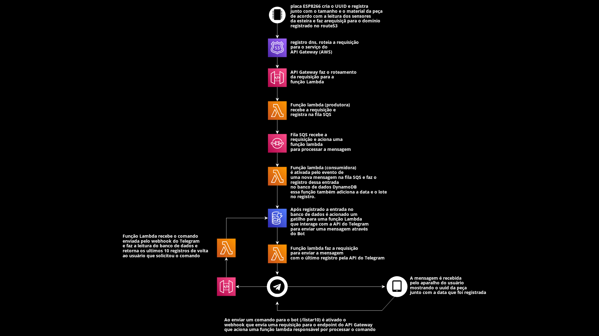

# [WIP] Trabalho do Curso de Robótica Industrial Senai

## Todo-list

- [x] substituir o botão pela leitura do sensor óptico da esteira
- [x] refatorar o código com o design de sensores da esteira
- [x] acionar a o robô remotamente via esp8266
