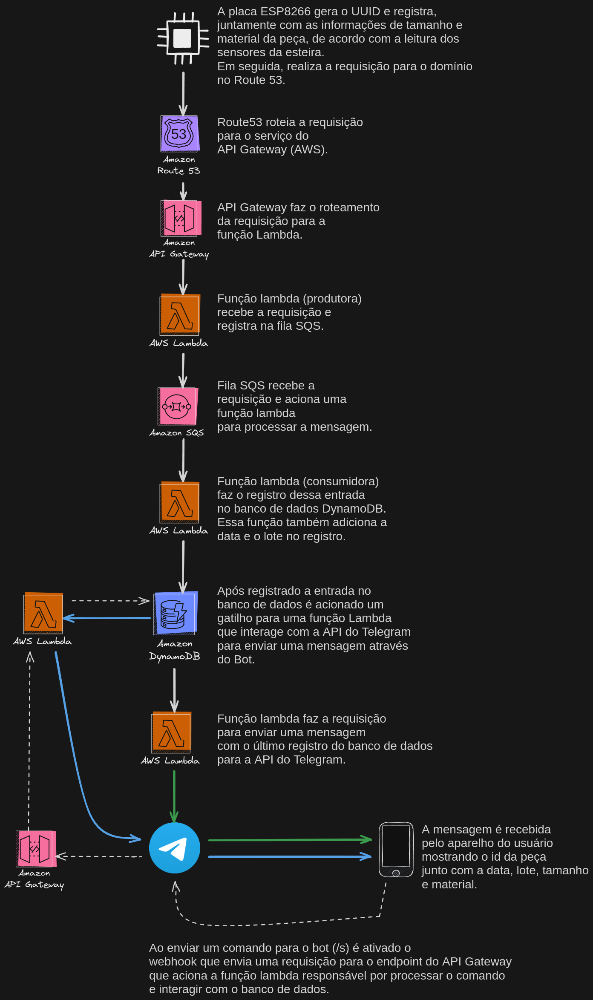

# Projeto do Curso de Robótica Industrial Senai.

Projeto desenvolvido com o objetivo de integrar o microcontrolador ESP-8266 em uma arquitetura serverless na nuvem AWS. Esta iniciativa visa a criação de um dispositivo IoT que se conecta diretamente à linha de produção, realizando o registro preciso das peças à medida que passam pelo leitor. A integração permite um monitoramento em tempo real e fornece dados para otimização de processos na indústria.

## Integração com a Esteira e o CB3.

https://github.com/fabioalmeida08/SenaiRoboticaIndustrial/assets/91635002/e2af3b2e-c791-4f21-a8f7-2d7d5c425506

Sistema onde cada passagem de peça pelos leitores da esteira envia um sinal à placa responsável por montar a estrutura a ser enviada para a arquitetura AWS. Além disso, essa placa está integrada à plataforma Blynk, proporcionando uma visão detalhada do total de peças que passaram pelo sensor, juntamente com informações sobre seus tamanhos.

OBS: No vídeo, é possível visualizar a notificação do Telegram relacionada à peça em questão, exatamente aos 40 segundos.

## Integração com API do Telegram.

#### Recebimento de mensagens.

Após cada registro de peça no sistema, uma notificação automatizada é imediatamente enviada para o Telegram, fornecendo informações sobre a última peça registrada.

https://github.com/fabioalmeida08/SenaiRoboticaIndustrial/assets/91635002/c1eece0f-74c3-4a23-9588-12d1d96e31a0

#### Comandos do bot.

A integração do bot com a arquitetura possibilita não apenas consultar, mas também filtrar o registro das últimas 5 peças com base em critérios como tipo de peça e seu tamanho específico.

https://github.com/fabioalmeida08/SenaiRoboticaIndustrial/assets/91635002/a7ba8ece-9185-4cb9-a5ad-eacc215e6937

https://github.com/fabioalmeida08/SenaiRoboticaIndustrial/assets/91635002/c56ebadb-460d-4619-922b-0712a75c0714

#### Comandos inválidos.

Ao receber um comando inválido, o bot responde automaticamente com uma mensagem que orienta sobre os comandos válidos a serem utilizados.

https://github.com/fabioalmeida08/SenaiRoboticaIndustrial/assets/91635002/4227fa20-0a7b-4ea6-b734-785641cf6482

#### Lcd acoplado a placa mostrando informações da peça.

https://github.com/fabioalmeida08/SenaiRoboticaIndustrial/assets/91635002/5108b730-72b5-47b9-831c-705459159f65

## Todo-list

- [x] substituir o botão pela leitura do sensor óptico da esteira
- [x] refatorar o código com o design de sensores da esteira
- [x] acionar a o robô remotamente via esp8266
